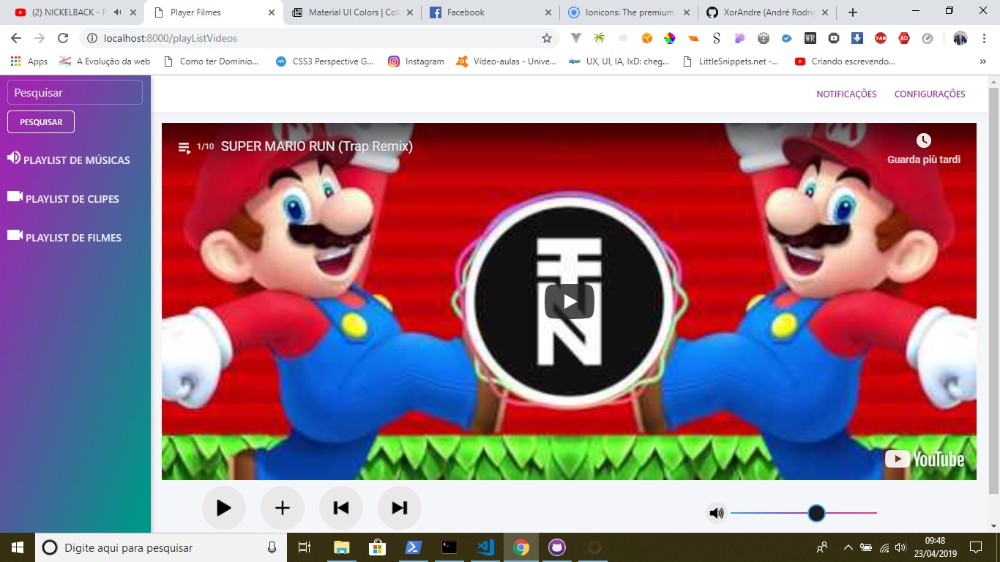

# Player-de-video-com-NodeJS

Este é um player simples para execução de músicas, vídeos clipes pela api do Youtube e filmes com a API do Xiften. A ideia é ter uma versão com Electron (aplicação desktop) e uma online.

## Instruções para usa-lo

1) Clone o projeto e depois abra a pasta do projeto no terminal 
2) Baixe as depedências pelo comando: npm install 
3) Rode o comando npm start

## Observações

O player é uma brincadeira que fiz não foi com intuito de vender
